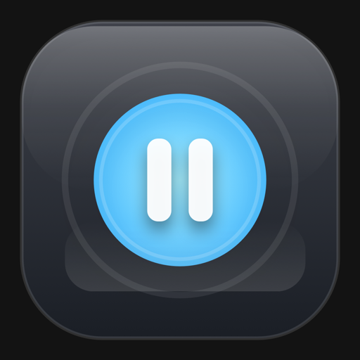

# Mac Pause



Mac Pause is a small macOS menu bar utility for one job: temporarily suspend input so you can clean your Mac without triggering keys, clicks, scrolls, brightness changes, or media controls by accident.

It is built as a direct-download app, not an App Store product. The app lives in the menu bar, asks for the two permissions it needs, and exits cleaning mode only when you hold `Right Shift + Escape` or when the failsafe timer expires.

## Why Mac Pause

- Prevent accidental key presses while wiping down your keyboard.
- Block clicks, scrolls, and pointer movement during a cleaning session.
- Keep a hard failsafe timeout so you cannot get stuck in cleaning mode.
- Support quick presets and configurable session defaults.
- Stay out of the Dock as a focused menu bar utility.

## Core Features

- Global cleaning mode with a session-level input blocker.
- Unlock chord: hold `Right Shift + Escape`.
- Failsafe timeout with automatic recovery.
- Countdown before cleaning begins.
- Partial modes:
  - `Full Lock`
  - `Keyboard Only`
  - `Pointer Only`
- Cleaning backdrops:
  - `Classic HUD`
  - `Black Screen`
  - `Gray Screen`
  - `White Screen`
- Launch at Login support.
- Built-in permission guidance and refresh flow.

## macOS Requirements

- macOS 13 or later

## Permissions

Mac Pause requires:

- `Accessibility`
- `Input Monitoring`

You can find them in:

- `System Settings > Privacy & Security > Accessibility`
- `System Settings > Privacy & Security > Input Monitoring`

`Input Monitoring` often requires a full quit and reopen before macOS reports it correctly.

## Install a Shared Build

If someone sends you a packaged release zip:

1. Unzip it.
2. Drag `Mac Pause.app` into `/Applications`.
3. Open the app once from Finder.
4. If macOS warns that the developer cannot be verified, right-click the app and choose `Open`.
5. Grant `Accessibility` and `Input Monitoring` when prompted.
6. Quit and reopen once after enabling `Input Monitoring`.

If Gatekeeper still blocks the app after download, remove the quarantine flag:

```bash
xattr -dr com.apple.quarantine "/Applications/Mac Pause.app"
```

## Build From Source

Build a local bundled app:

```bash
./Scripts/build_app_bundle.sh
```

Run the bundled app:

```bash
./Scripts/run_bundled_app.sh
```

Run tests:

```bash
swift test --disable-sandbox
```

## Create a Shareable Release

Build a release bundle and zip package:

```bash
./Scripts/package_release.sh
```

This creates:

- `Build/Release/Mac Pause.app`
- `Build/Release/MacPause-<version>.zip`
- `Build/Release/MacPause-<version>.zip.sha256`

The release zip includes:

- `Mac Pause.app`
- `INSTALL.txt`

## Distribution Notes

Mac Pause is currently packaged as a direct-download app bundle and ad-hoc signed during local builds. That is enough for personal use and private sharing, but it is not the smoothest distribution path for strangers on the internet.

If you want broader distribution later, the next step is:

1. Sign with a Developer ID Application certificate.
2. Notarize the app with Apple.
3. Repackage the notarized build for download.

That will avoid most Gatekeeper friction without requiring the App Store.

## Safety Model

- Cleaning mode always has a timeout.
- Unlocking requires an intentional hold, not a tap.
- The app never disables hardware directly; it suppresses events while active.
- If permissions are missing, cleaning mode does not start.

## Current Default Behavior

- `3s` arming countdown
- `2s` unlock hold
- `60s` failsafe timeout
- `Full Lock`
- `Classic HUD`
